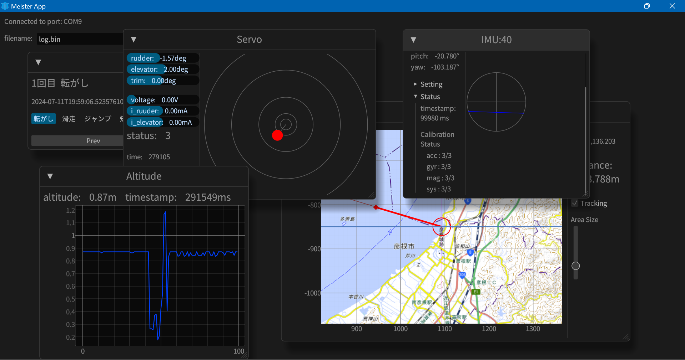

<div align="center">

# helium

A lightweight viewer for Team NABA's avionics system.

</div>



## Installation

### From source

With Rust's package manager cargo, you can install

```sh
cargo install --git https://github.com/TeamMeltingPoppo/helium --branch main
```

## Usage

```sh
helium
```
